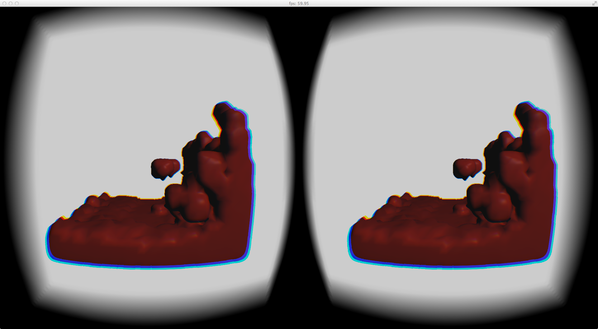

Smoothed Particle Hydrodynamics in Oculus Rift DK2

Dependencies:

	* GLFW
	* GLEW
	* OpenGL 4.0+ compatible graphics card
	* Oculus Rift DK2
	* Mac OS X 10.9.4 (tested)

Functionalities:

  * Smoothed Particle Hydrodynamics
  * Tessellation control using keys (T-Y-G-H): T and Y increase inner and outer tessellation factor; G and H decrease outer tessellation factor
  * K render faces
  * L wireframe

If you find it helpful, please feel free to let me know at wang.yu@umbc.edu.

